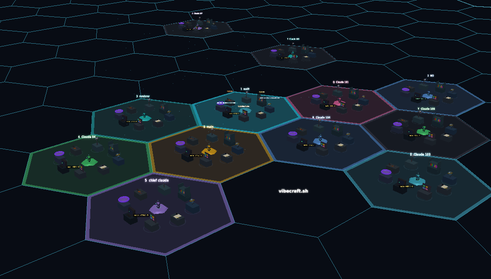
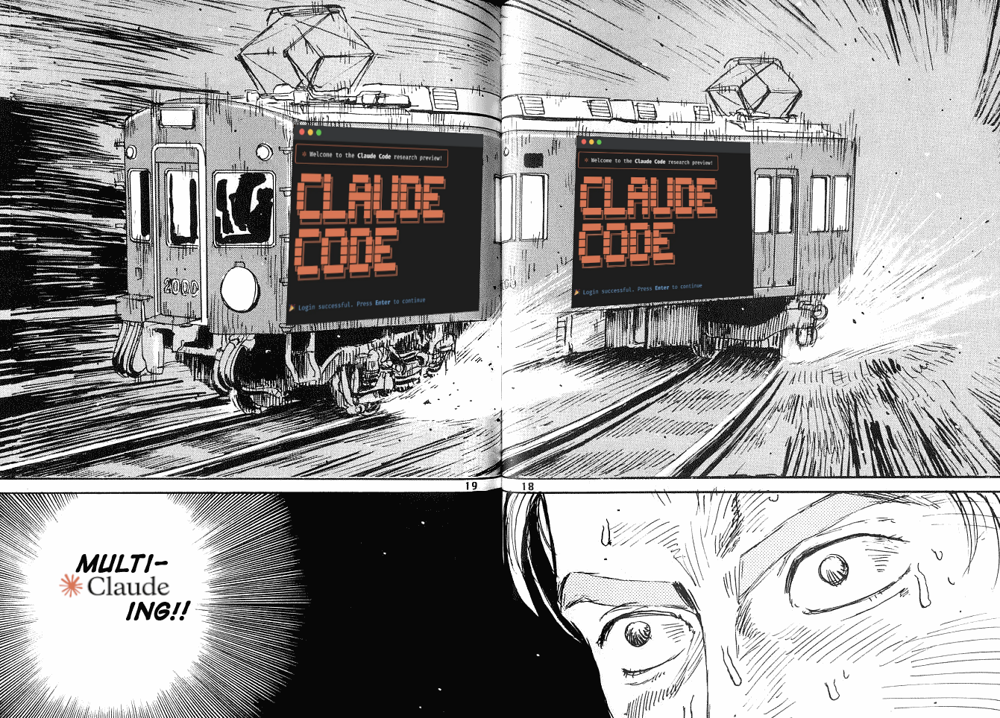

# Vibecraft



**A 3D visualization dashboard for Claude Code** — Watch your AI coding assistant work in real-time!

**[Try it instantly at vibecraft.sh](https://vibecraft.sh)** — connects to your local Claude Code instances, no data shared.

  

---

## What is Vibecraft?

Vibecraft transforms Claude Code into an interactive 3D workshop. Watch your AI assistant move between stations as it reads files, edits code, runs commands, and spawns subagents. Each tool has its own workstation, and you can manage multiple Claude instances from a single dashboard.

### Key Features

- **Real-time 3D Visualization** — See Claude work at themed stations (bookshelf, terminal, workbench)
- **Multi-Session Management** — Run and control multiple Claude instances simultaneously
- **8 Unique Characters** — Robot, Wizard, Ninja, Pacman, Afro Samurai, Rick, Morty, Flower
- **Achievement System** — Unlock 25+ achievements for using tools, making commits, and more
- **Spatial Audio** — Hear where Claude is working with 3D positional sound
- **Voice Input** — Speak prompts with real-time transcription
- **Draw Mode** — Paint hex tiles in the 3D world
- **Git Integration** — Confetti celebrations on commits!

---

## Quick Start

### Requirements

- **macOS or Linux** (Windows WSL supported)
- **Node.js** 18+
- **jq** — JSON processor (`brew install jq` / `apt install jq`)
- **tmux** — Terminal multiplexer (`brew install tmux` / `apt install tmux`)

### Installation

```bash
# 1. Install dependencies
brew install jq tmux       # macOS
# sudo apt install jq tmux  # Ubuntu/Debian

# 2. Configure hooks (one time)
npx vibecraft setup

# 3. Start server
npx vibecraft
```

Open **http://localhost:4003** and use Claude Code normally. You'll see Claude move around the workshop!

### From Source

```bash
git clone https://github.com/nearcyan/vibecraft
cd vibecraft && npm install && npm run dev
# Opens on http://localhost:4002
```

### Uninstall

```bash
npx vibecraft uninstall  # Removes hooks, keeps your data
```

---

## Features

### 3D Workshop Scene

Each Claude session gets its own **hexagonal zone** with 9 workstations:

| Station         | Tools               | Visual                  |
| --------------- | ------------------- | ----------------------- |
| **Bookshelf**   | Read                | Books on wooden shelves |
| **Desk**        | Write               | Paper, pencil, ink pot  |
| **Workbench**   | Edit                | Wrench, gears, bolts    |
| **Terminal**    | Bash                | Glowing green screen    |
| **Scanner**     | Grep, Glob          | Telescope with lens     |
| **Antenna**     | WebFetch, WebSearch | Satellite dish          |
| **Portal**      | Task (subagents)    | Glowing ring portal     |
| **Taskboard**   | TodoWrite           | Board with sticky notes |
| **MCP Station** | MCP tools           | Dynamic allocation      |

### Characters

Switch between 8 unique character models in Settings:

| Character        | Style            | Special Features                       |
| ---------------- | ---------------- | -------------------------------------- |
| **ClaudeMon**    | Friendly robot   | Mood system, LED eyes, thought bubbles |
| **Wizard**       | Mystical mage    | Glowing staff, magical particles       |
| **Ninja**        | Stealthy warrior | Dark aesthetic                         |
| **Pacman**       | Arcade classic   | Chomping animation                     |
| **Afro Samurai** | Warrior          | Katana, traditional kimono             |
| **Rick**         | Genius scientist | Lab coat aesthetic                     |
| **Morty**        | Nervous sidekick | Anxious animations                     |
| **Flower**       | Whimsical        | Radiating petals                       |

### Achievement System

Unlock achievements by using Vibecraft:

**Tool Achievements**

- Bookworm — Use Read for the first time
- Speed Reader — Use Read 100 times
- Terminal Rookie — First Bash command
- Shell Master — 100 Bash commands
- Jack of All Trades — Use 5 different tools

**Session Achievements**

- Getting Started — Create your first session
- Session Veteran — Create 10 sessions
- Zone Master — Have 3 active zones at once

**Milestone Achievements**

- Thousand Words — Use 1,000 tokens
- Heavy User — Use 10,000 tokens
- Power User — Use 100,000 tokens
- Tool Century — 100 total tool uses
- Tool Millennium — 1,000 total tool uses

**Special Achievements**

- First Commit — Make your first git commit
- Commit Streak — Make 10 git commits
- Night Owl — Use Vibecraft after midnight (secret)
- Early Bird — Use Vibecraft before 6 AM (secret)
- Wizard Mode — Select the Wizard character (secret)
- Way of the Samurai — Select Afro Samurai (secret)

### Multi-Session Management



Run multiple Claude instances simultaneously:

1. Click **"+ New"** (or `Alt+N`) to spawn a new session
2. Configure name, directory, and CLI flags
3. Click a session or press `1-6` to switch
4. Each session has its own 3D zone

**Session Features:**

- Pin sessions to keep them at the top
- Drag-drop to reorder
- Archive inactive sessions
- Health monitoring (idle/working/offline)
- Token usage tracking per session

### Audio System

Synthesized sound effects for all actions:

| Category    | Sounds                                                   |
| ----------- | -------------------------------------------------------- |
| **Tools**   | Read, Write, Edit, Bash, Grep, WebFetch, Task, TodoWrite |
| **Events**  | Success, Error, Walking, Spawn, Despawn, Notification    |
| **Special** | Git commit fanfare with shimmer                          |

**Spatial Audio** — Sounds come from the 3D position of the active zone. Zones to your left play in the left speaker!

### Voice Input

Speak prompts with real-time transcription:

1. Press `Alt+R` or click the microphone button
2. Speak your prompt
3. Watch transcription appear in real-time
4. Press again to stop and send

Requires a Deepgram API key (set in environment or Settings).

### Draw Mode

Paint the hex grid floor:

1. Press `D` to enter draw mode
2. Select colors with `1-6`, eraser with `0`
3. Adjust brush size with `Q/E` (1-4 hexes)
4. Toggle 3D stacking with `R`
5. Clear all with `X`
6. Press `D` or `Esc` to exit

### Plugin System

Extend Vibecraft with plugins:

| Plugin              | Description                             |
| ------------------- | --------------------------------------- |
| **Model Selector**  | Choose Claude model (Sonnet/Opus/Haiku) |
| **Thinking Toggle** | Enable extended thinking mode           |
| **MCP List**        | View connected MCP servers              |

---

## Keyboard Shortcuts

### General

| Key           | Action                                     |
| ------------- | ------------------------------------------ |
| `Tab` / `Esc` | Switch between Workshop and Feed           |
| `1-6`         | Switch to session 1-6                      |
| `Q-Y`         | Sessions 7-12                              |
| `A-H`         | Sessions 13-18                             |
| `0` / `` ` `` | All sessions overview                      |
| `Alt+N`       | New session modal                          |
| `Alt+A`       | Jump to session needing attention          |
| `Alt+Space`   | Expand latest "show more" in feed          |
| `Alt+R`       | Toggle voice recording                     |
| `Alt+D`       | Toggle developer panel                     |
| `F`           | Toggle follow-active mode                  |
| `P`           | Toggle station panels                      |
| `D`           | Toggle draw mode                           |
| `Ctrl+C`      | Copy selection / interrupt working session |

### Draw Mode

| Key         | Action                         |
| ----------- | ------------------------------ |
| `1-6`       | Select color                   |
| `0`         | Eraser                         |
| `Q` / `E`   | Decrease / increase brush size |
| `R`         | Toggle 3D stacking             |
| `X`         | Clear all painted hexes        |
| `D` / `Esc` | Exit draw mode                 |

---

## CLI Options

```bash
vibecraft [options]

Options:
  --port, -p <port>    WebSocket server port (default: 4003)
  --help, -h           Show help
  --version, -v        Show version
```

### Environment Variables

| Variable                | Default | Description             |
| ----------------------- | ------- | ----------------------- |
| `VIBECRAFT_PORT`        | 4003    | WebSocket server port   |
| `VIBECRAFT_CLIENT_PORT` | 4002    | Vite dev server port    |
| `VIBECRAFT_DEBUG`       | false   | Enable verbose logging  |
| `DEEPGRAM_API_KEY`      | —       | API key for voice input |

---

## API Endpoints

| Endpoint                    | Method   | Description                     |
| --------------------------- | -------- | ------------------------------- |
| `/health`                   | GET      | Server health check             |
| `/stats`                    | GET      | Event statistics                |
| `/prompt`                   | POST     | Send prompt to tmux session     |
| `/cancel`                   | POST     | Send Ctrl+C to session          |
| `/api/sessions`             | GET/POST | Session management              |
| `/api/sessions/:id/prompt`  | POST     | Send prompt to specific session |
| `/api/changes`              | GET      | File change history             |
| `/api/changes/:id/rollback` | POST     | Rollback a file change          |

---

## Data Storage

### Browser (localStorage)

- Achievement progress
- Plugin settings
- Keyboard shortcuts
- User preferences
- Hex art paintings

### Server (`~/.vibecraft/data/`)

- `events.jsonl` — Event log
- `sessions.json` — Session state
- `config.json` — Server config
- `tiles.json` — Text labels

---

## Documentation

- **[CLAUDE.md](CLAUDE.md)** — Technical documentation for developers
- **[docs/SOUND.md](docs/SOUND.md)** — Complete sound system reference
- **[docs/STORAGE.md](docs/STORAGE.md)** — Data persistence guide
- **[docs/ORCHESTRATION.md](docs/ORCHESTRATION.md)** — Multi-session API
- **[docs/SETUP.md](docs/SETUP.md)** — Detailed setup guide

---

## Contributing

Contributions welcome! See [CLAUDE.md](CLAUDE.md) for codebase architecture.

```bash
# Development
npm run dev          # Start dev server
npm run build        # Build for production
npm run build:client # Build frontend only
npm run build:server # Build server only
```

---

## License

MIT

---

**Website:** https://vibecraft.sh

**GitHub:** https://github.com/nearcyan/vibecraft
